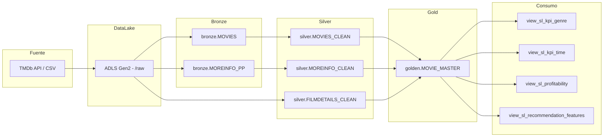
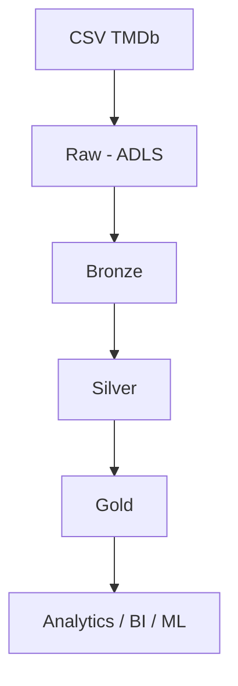

# CICD_MOVIES_SMARTDATA
Proyecto de arquitectutra Medallion sobre peliculas mas vistas
# 🎬 Lakehouse de Analítica de Películas en Databricks

---

## 📌 Descripción General

Este proyecto implementa una **arquitectura Lakehouse moderna (Medallion Architecture)** en Databricks para procesar y analizar un dataset de **9,718 películas** obtenido desde TMDb.
la data para la realizacion de este ejercicio fue tomada de la siguiente fuente: https://www.kaggle.com/datasets/hassanelfattmi/which-movie-should-i-watch-today

El objetivo es transformar datos crudos en información analítica de alto valor, permitiendo:

* 📊 Análisis de tendencias
* 💰 Evaluación de rentabilidad
* 🎯 Sistemas de recomendación

---

## 🧱 Arquitectura General (Vista Técnica)



---

## 🗂️ Flujo de Datos (Vista Funcional)



---

## 🔹 Capa Raw (ADLS)

📍 Ubicación:

```
adlsmovieproject/raw
```

* Datos en formato original (CSV)
* Sin transformaciones
* Fuente de verdad

---

## 🥉 Capa Bronze

📌 Tablas:

* `bronze.MOVIES`
* `bronze.MOREINFO_PP`

📌 Características:

* Ingesta directa desde CSV
* Datos sin limpiar
* Preserva inconsistencias

Ejemplo de problema:

```
$ 2'500.000
$25,000,000
```

---

## 🥈 Capa Silver

📌 Tablas:

* `silver.MOVIES_CLEAN`
* `silver.FILMDETAILS_CLEAN`
* `silver.MOREINFO_CLEAN`

---

### 🔧 Transformaciones

* Limpieza de datos financieros
* Normalización de schemas
* Conversión de tipos
* Manejo de nulos

---

### 💡 Ejemplo de limpieza (PySpark)

```python
from pyspark.sql.functions import regexp_replace, col

def limpiar_moneda(columna):
    return regexp_replace(col(columna), r"[^0-9]", "").cast("double")
```

---

## 🥇 Capa Gold

📌 Tabla:

* `golden.MOVIE_MASTER`

📌 Contiene:

* Datos integrados y listos para análisis
* Información enriquecida de múltiples fuentes

---

## 📊 Vistas Analíticas

### 📈 `view_sl_kpi_genre`

* Métricas agregadas por género

### ⏳ `view_sl_kpi_time`

* Tendencias temporales

### 💰 `view_sl_profitability`

* ROI y ranking de películas

### 🎯 `view_sl_recommendation_features`

* Features para recomendaciones

---
### 🎯 `Explotacion de la capa Golden`

                        gold_movie_master
                          (core dataset)
                                ↓
     ┌─────────────────┬─────────────────┬─────────────────┐
     ↓                 ↓                 ↓                 ↓
 **gold_kpi_genre - gold_kpi_time - gold_profitability - gold_top_content**

                  (BI / Analytics)

                         ↓
            gold_recommendation_features
                (ML / AI use case)

---

## 📂 Dataset

### Movies.csv

* Información general

### FilmDetails.csv

* Directores, actores, métricas financieras

### MoreInfo.csv

* Datos financieros con formato string

### PosterPath.csv

* URLs de imágenes

---

## ⚙️ Tecnologías

* Databricks
* Apache Spark (PySpark)
* Delta Lake
* Azure Data Lake Storage Gen2
* Unity Catalog
* Python / SQL

---

## 🧠 Buenas Prácticas

* Arquitectura Medallion
* Uso de Delta Lake (ACID)
* Evitar UDFs (uso de funciones nativas)
* Tipado fuerte en Silver
* Separación de responsabilidades

---

## ⚠️ Retos

### Problema:

Datos financieros inconsistentes

### Solución:

* Regex para limpieza
* Conversión a tipos numéricos

---

## 🚀 Casos de Uso

* Recomendación de películas
* Análisis de tendencias
* Evaluación financiera

---

## 🔮 Futuras Mejoras

* MERGE INTO (upserts)
* Data Quality Checks
* Integración con BI
* Machine Learning

---

## 👨‍💻 Autor

**John Camargo**
Ingeniero de Datos

---

## ⭐ Conclusión

Este proyecto demuestra cómo construir un **Lakehouse escalable y gobernado**, transformando datos crudos en insights accionables mediante buenas prácticas de ingeniería de datos.

---
